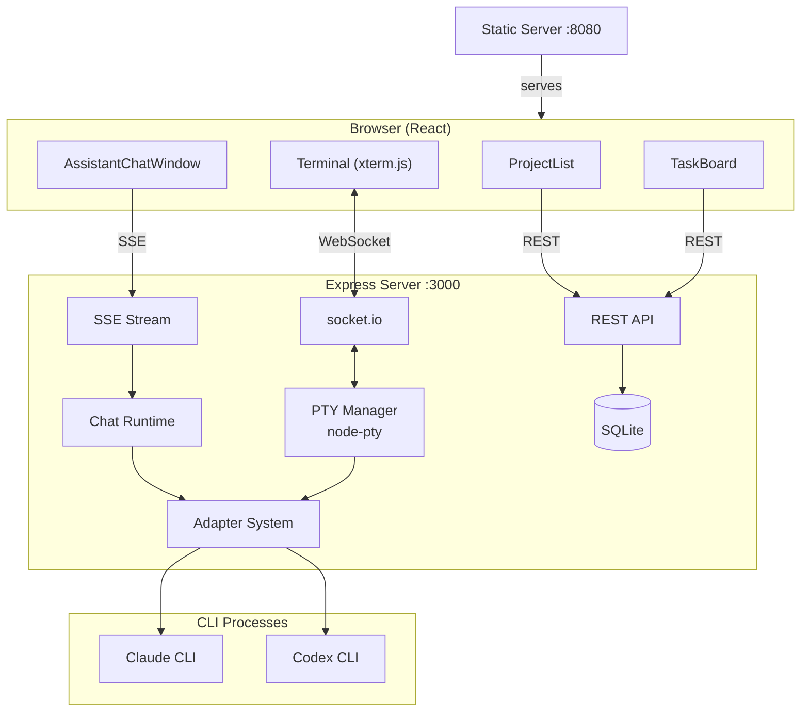

# Claude Code Manager

Web-based management interface for running multiple Claude Code / Codex sessions in parallel. Browser-based terminal (xterm.js) with real-time I/O, task-scoped chat, and session recovery.

## Architecture



Three communication channels: REST (CRUD), WebSocket (terminal I/O), SSE (chat streaming). See [docs/architecture.md](docs/architecture.md) for detailed diagrams.

## Quick Start

```bash
# Install
npm install && cd client && npm install && cd ..

# Configure
cp .env.example .env  # Edit with your settings

# Development
cd client && npm run dev &   # Frontend :5173 (with proxy)
npm run dev                   # API :3000

# Production
npm run build
pm2 start server/index.js --name ccm-api
pm2 start static-server.js --name ccm-static
```

## Environment Variables

| Variable | Description | Default |
|----------|-------------|---------|
| `PORT` | API server port | 3000 |
| `STATIC_PORT` | Static server port | 8080 |
| `FRONTEND_URL` | Frontend URL for CORS | http://localhost:8080 |
| `ACCESS_TOKEN` | Bearer token for API auth | — |
| `NOTION_TOKEN` | Notion integration token | — |
| `NOTION_PROJECTS_DB` | Notion Projects database ID | — |
| `NOTION_TASKS_DB` | Notion Tasks database ID | — |
| `WORKFLOW_DIR` | Path to claude-workflow | ~/Documents/claude-workflow |

## Tech Stack

- Express, socket.io, node-pty, better-sqlite3, chokidar
- React 18, xterm.js, Tailwind CSS, Vite
- PM2, SQLite, GitHub webhook auto-deploy
