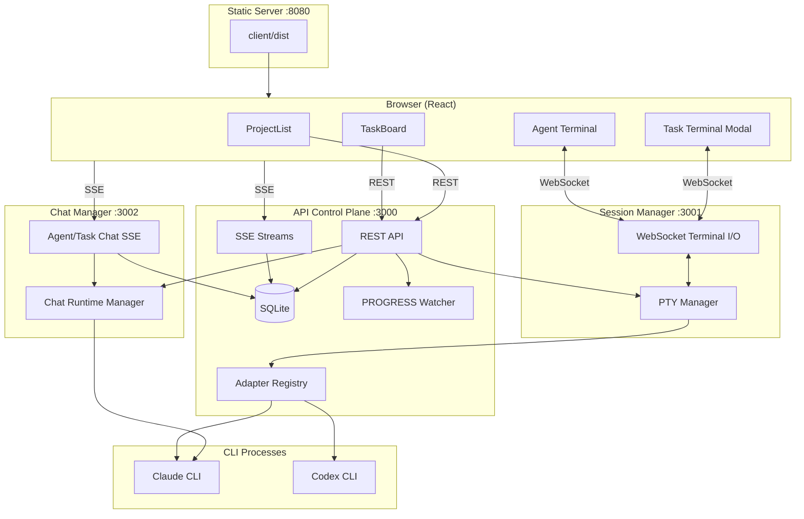

# Claude Code Manager

Web UI for running and supervising multiple Claude Code / Codex sessions in parallel. The current product is terminal-first: projects and tasks are managed in the browser, each running task gets a PTY-backed terminal, and the home screen also exposes a main agent terminal. Session recovery, buffered replay, adapter selection, and lightweight persistence are built in.

## Architecture



Communication in the live system uses three patterns:

- REST for project/task CRUD and control operations
- WebSocket for interactive terminal I/O via the dedicated session-manager process
- SSE for agent/task chat via the dedicated chat-manager process, plus terminal streaming/embed endpoints

Detailed reference:

- [`ARCHITECTURE.md`](ARCHITECTURE.md)

## Current Product Shape

- Browser UI with `ProjectList`, `TaskBoard`, task terminal modal, and a persistent home agent terminal
- Adapter-driven task startup for `claude` and `codex`
- PTY session buffering and replay on reconnect
- Terminal session continuity across `claude-manager-api` restarts when `SESSION_MANAGER_URL` points to `claude-manager-session`
- Chat runtime continuity across `claude-manager-api` restarts when `CHAT_MANAGER_URL` points to `claude-manager-chat`
- SQLite-backed persistence for projects, tasks, chat history, and agent session state
- Optional Notion sync and `PROGRESS.md` file watching

Note: task-scoped chat still exists on the backend, but the active UI flow is centered on terminals rather than a dedicated task chat panel.

## Quick Start

```bash
# Install dependencies
npm install
cd client && npm install && cd ..

# Configure
cp .env.example .env

# Development
cd client && npm run dev    # Frontend :5173 (Vite)
npm run dev                 # API :3000
npm run dev:session         # Session manager :3001 (optional but required for restart-safe terminals)
npm run dev:chat            # Chat manager :3002 (optional but required for restart-safe chat streams)

# Production build
npm run build

# Production processes
pm2 start server/session-manager.js --name claude-manager-session
pm2 start server/chat-manager.js --name claude-manager-chat
pm2 start server/index.js --name claude-manager-api
pm2 start static-server.js --name claude-manager-static
```

To enable split runtime mode, export these environment variables for the API process:

```bash
export SESSION_MANAGER_URL=http://127.0.0.1:3001
export SESSION_MANAGER_PUBLIC_PORT=3001
export CHAT_MANAGER_URL=http://127.0.0.1:3002
export CHAT_MANAGER_PUBLIC_PORT=3002
```

## Deployment

Production deploys are remote-only and go through `./deploy.sh` after pushing to `origin/main`.

Detailed reference:

- [`DEPLOYMENT.md`](./DEPLOYMENT.md)

## Configuration

Environment variables, runtime notes, and stack summary live here:

- [`CONFIGURATION.md`](./CONFIGURATION.md)
