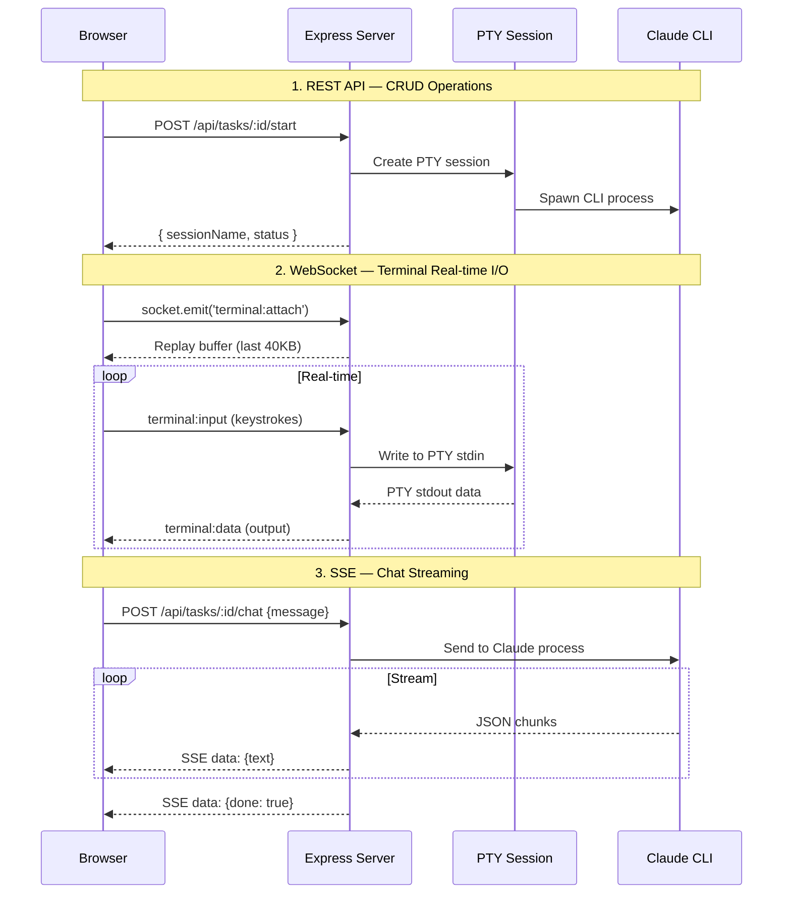
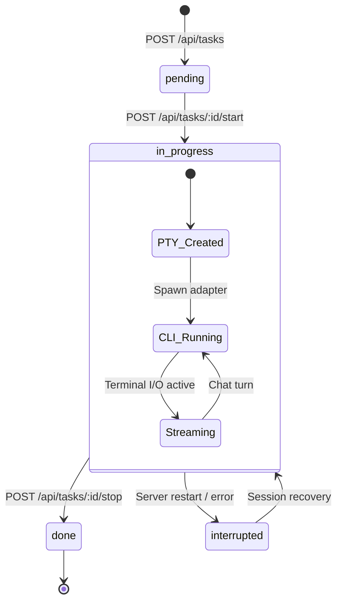
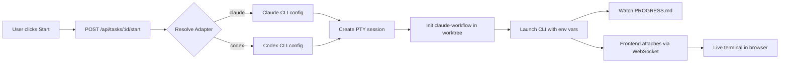
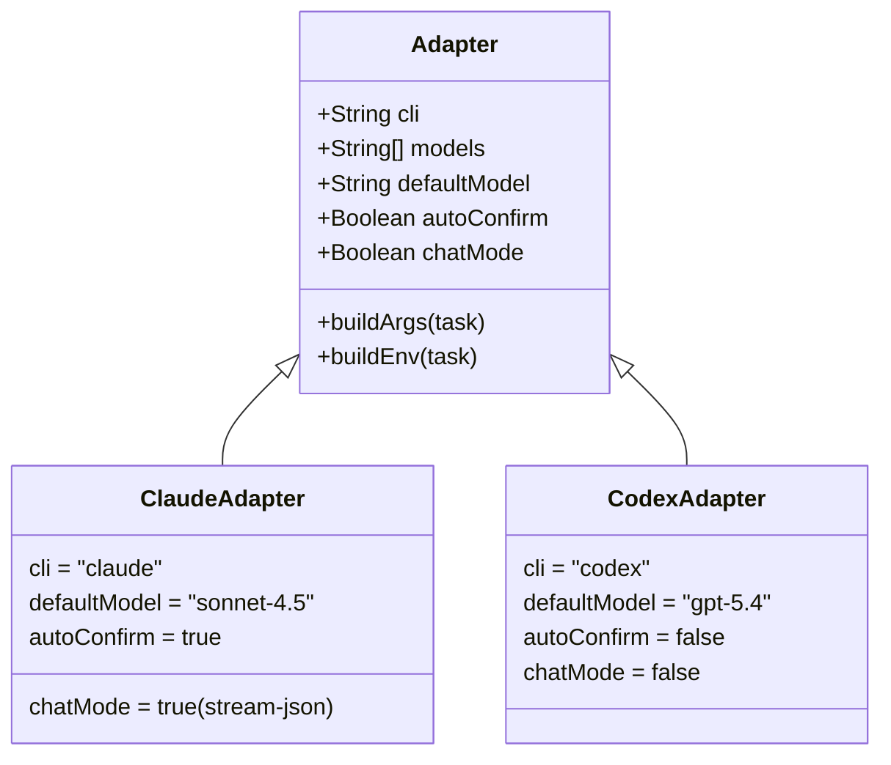
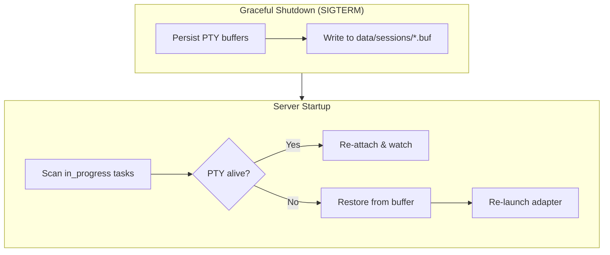
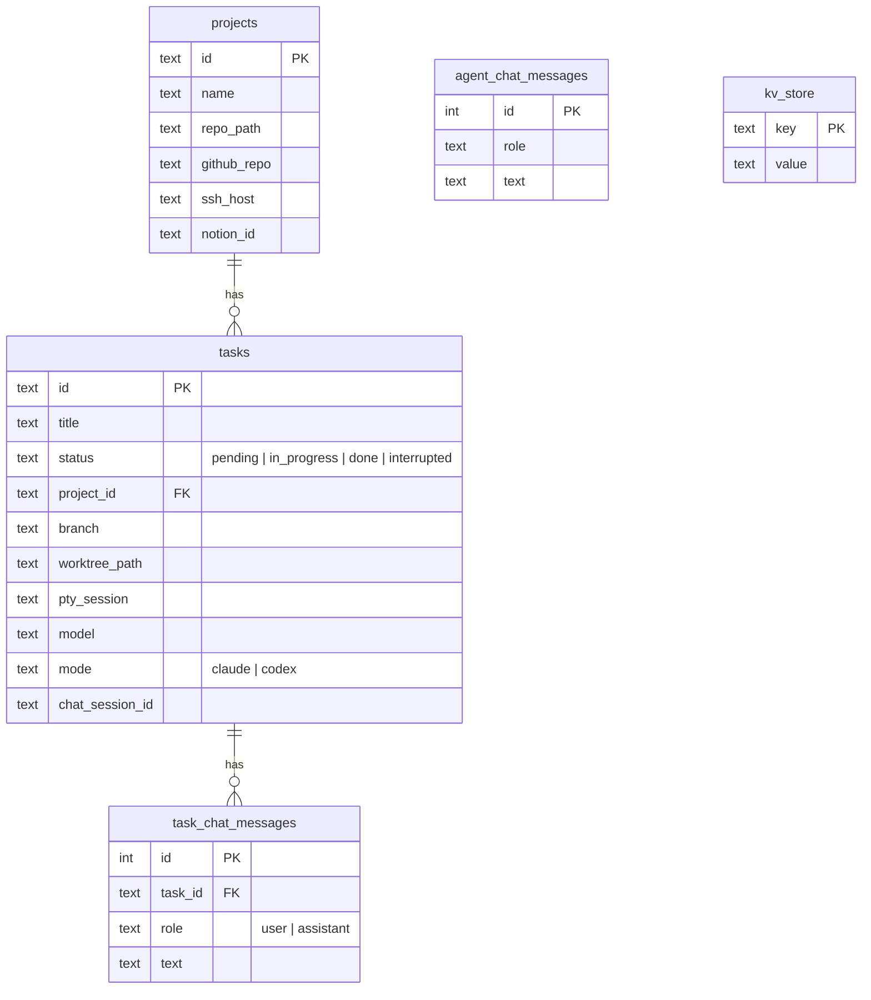

# Architecture

Detailed technical documentation for Claude Code Manager internals.

## Communication Patterns

Three communication channels between frontend and backend:



## Task Lifecycle



## Task Start Flow



## Adapter System

Pluggable adapter pattern for different CLI tools:



## Session Recovery

PTY sessions survive server restarts:



## Database Schema



## Project Structure

```
claude-code-manager/
├── server/
│   ├── index.js              # Express entry point, routes, socket.io
│   ├── db.js                 # SQLite (WAL mode, auto-migration)
│   ├── pty-manager.js        # PTY session lifecycle & buffer
│   ├── task-chat-runtime.js  # Claude chat with session persistence
│   ├── file-watcher.js       # PROGRESS.md → Notion sync
│   ├── notion-sync.js        # Async Notion API (non-blocking)
│   ├── claude-env.js         # Claude environment setup
│   └── adapters/
│       ├── claude.js          # Claude Code adapter
│       └── codex.js           # Codex adapter
├── client/
│   ├── src/
│   │   ├── App.jsx            # Main state management
│   │   ├── components/
│   │   │   ├── Terminal.jsx       # xterm.js + socket.io
│   │   │   ├── TaskBoard.jsx      # Task list & actions
│   │   │   ├── ProjectList.jsx    # Project CRUD
│   │   │   └── AssistantChatWindow.jsx  # SSE chat UI
│   │   ├── hooks/
│   │   │   └── useSocket.js       # Socket.io singleton
│   │   └── config.js             # API base URL
│   └── dist/                     # Built static files
├── data/
│   ├── manager.db                # SQLite database
│   └── sessions/                 # Persisted PTY buffers
├── deploy.sh                     # Remote deploy script
├── static-server.js              # Static file server :8080
└── package.json
```

## API Reference

| Method | Endpoint | Description |
|--------|----------|-------------|
| GET | `/api/projects` | List all projects |
| POST | `/api/projects` | Create project |
| PUT | `/api/projects/:id` | Update project |
| DELETE | `/api/projects/:id` | Delete project + tasks |
| GET | `/api/tasks?projectId=` | List tasks for project |
| POST | `/api/tasks` | Create task |
| POST | `/api/tasks/:id/start` | Start CLI session |
| POST | `/api/tasks/:id/stop` | Stop session |
| DELETE | `/api/tasks/:id` | Delete task |
| POST | `/api/tasks/:id/chat` | Task-scoped chat (SSE) |
| GET | `/api/tasks/:id/chat/history` | Chat history |
| POST | `/api/agent` | Global agent chat (SSE) |
| POST | `/api/deploy` | Trigger deploy.sh |
| POST | `/api/webhook/github` | GitHub push auto-deploy |
